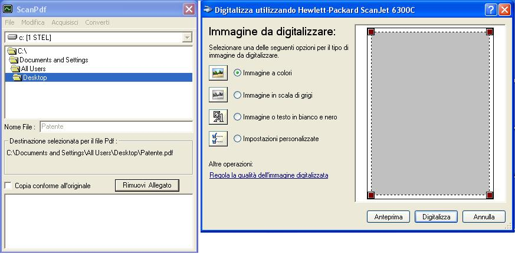



## ScanPdf

### Description

Create Pdf from ClipBoard, Scanner, saved Image, or Word Document. It's possible to lock the pdf file, or write on every page "Copia Conforme".
 
### More Info
 
Path of the new file, source of the file.

Simple to use and learn.

             |
---                |---
**Submitted On**   |2005-08-04 12:10:04
**By**             |[Ciarmiello Martino](https://github.com/Planet-Source-Code/PSCIndex/blob/master/ByAuthor/ciarmiello-martino.md)
**Level**          |Advanced
**User Rating**    |3.6 (18 globes from 5 users)
**Compatibility**  |VB 6\.0
**Category**       |[Complete Applications](https://github.com/Planet-Source-Code/PSCIndex/blob/master/ByCategory/complete-applications__1-27.md)
**World**          |[Visual Basic](https://github.com/Planet-Source-Code/PSCIndex/blob/master/ByWorld/visual-basic.md)
**Archive File**   |[ScanPdf1995065182006\.zip](https://github.com/Planet-Source-Code/ciarmiello-martino-scanpdf__1-65371/archive/master.zip)

